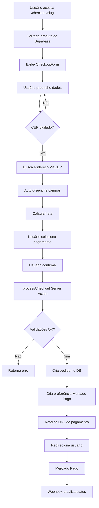

# 🛒 Guia Completo do Sistema de Checkout

## 📋 Visão Geral

O sistema de checkout do Tech4Loop foi desenvolvido seguindo as melhores práticas do mercado (Shopee, Mercado Livre, Amazon) com foco em:

- ✅ Simplicidade e usabilidade
- ✅ Múltiplos métodos de pagamento
- ✅ Auto-preenchimento inteligente
- ✅ Responsividade total
- ✅ Integração com Mercado Pago

---

## 🎯 Funcionalidades Principais

### 1. **Layout Moderno em 2 Colunas**

- **Coluna Esquerda**: Formulário de checkout
- **Coluna Direita**: Resumo do pedido (sticky)
- **Mobile**: Layout adaptativo em coluna única

### 2. **Formulário Simplificado**

#### Campos Obrigatórios (apenas 7):

1. Nome Completo
2. WhatsApp
3. E-mail
4. CEP
5. Endereço
6. Cidade
7. Estado (UF)

#### Features dos Inputs:

- ✨ **Máscaras automáticas**: CEP (00000-000), Telefone ((00) 00000-0000)
- ✨ **Auto-preenchimento**: Via API ViaCEP ao digitar CEP
- ✨ **Validação em tempo real**: Estados de erro/sucesso
- ✨ **Placeholders úteis**: Exemplos em todos os campos

### 3. **Métodos de Pagamento**

#### Opções Disponíveis:

- 💳 **Cartão de Crédito**: Até 12x sem juros
- ⚡︎ **PIX**: Aprovação instantânea
- 📄 **Boleto Bancário**: Vencimento em 3 dias
- 📱 **Carteira Digital**: Mercado Pago, PicPay, etc.

#### Seleção Visual:

- Radio buttons customizados com cores distintas
- Ícones para cada método
- Informações adicionais (parcelamento, prazo)

### 4. **Cálculo de Frete Automático**

#### Regras de Frete:

```typescript
// CEPs de Rondônia (76xxx, 78xxx)
Frete: R$ 0,00
Prazo: 2 dias
Nome: "Entrega Regional"

// Outros estados com valor >= R$ 200
Frete: R$ 0,00
Prazo: 7 dias
Nome: "Entrega Nacional Grátis"

// Outros estados com valor < R$ 200
Frete: R$ 15,90
Prazo: 7 dias
Nome: "Entrega Nacional"
```

### 5. **Salvar Dados para Compras Futuras**

- Checkbox "Salvar meus dados"
- Armazenamento no `localStorage`
- Auto-preenchimento em compras futuras
- Privacidade: dados ficam apenas no navegador do usuário

---

## 🔧 Arquivos e Estrutura

### Componentes

#### `CheckoutForm.tsx`

```typescript
// Componente principal do checkout
// Localização: src/components/checkout/CheckoutForm.tsx

Features:
- Estado controlado do formulário
- Integração com ViaCEP
- Máscara de inputs
- Validação de dados
- Cálculo de frete dinâmico
- Resumo lateral do pedido
```

#### `CheckoutPage.tsx`

```typescript
// Página do checkout
// Localização: src/app/checkout/[slug]/page.tsx

Features:
- Server component
- Fetch do produto via Supabase
- Layout com steps visuais
- Badges de segurança
```

### Utilitários

#### `checkoutUtils.ts`

```typescript
// Funções auxiliares
// Localização: src/lib/checkoutUtils.ts

Funções disponíveis:
- formatCEP(value: string): string
- formatPhone(value: string): string
- isValidCEP(cep: string): boolean
- isValidPhone(phone: string): boolean
- isValidEmail(email: string): boolean
- fetchAddressByCEP(cep: string): Promise<Address>
- calculateShipping(cep: string, price: number): Shipping
- saveCheckoutData(data: SavedCheckoutData): void
- loadCheckoutData(): SavedCheckoutData | null
- clearCheckoutData(): void
- validateCheckoutForm(data: FormData): ValidationResult
```

### Hook Customizado

#### `useCheckout.ts`

```typescript
// Hook para facilitar uso do checkout
// Localização: src/hooks/useCheckout.ts

Uso: const {
  formData,
  updateField,
  handleCEPChange,
  handlePhoneChange,
  cepLoading,
  shipping,
  errors,
  validate,
  saveData,
  clearData,
} = useCheckout({
  autoLoadSavedData: true,
  productPrice: 299.9,
});
```

### Actions

#### `actions.ts`

```typescript
// Server action para processar checkout
// Localização: src/app/checkout/actions.ts

processCheckout():
1. Valida dados do formulário
2. Verifica estoque do produto
3. Valida cobertura geográfica (CEP)
4. Cria pedido no banco de dados (orders)
5. Cria item do pedido (order_items)
6. Cria preferência no Mercado Pago
7. Retorna URL de pagamento

Configurações por método de pagamento:
- credit_card: Exclui PIX e boleto
- pix: Apenas PIX habilitado
- boleto: Apenas boleto habilitado
- wallet: Apenas carteira digital
```

---

## 🚀 Como Usar

### 1. Acessar o Checkout

```typescript
// Usuário clica em "Comprar Agora" na página do produto
// Rota: /checkout/[slug]
// Exemplo: /checkout/fone-bluetooth-jbl

// O sistema automaticamente:
// - Carrega dados do produto
// - Exibe formulário de checkout
// - Prepara integração com Mercado Pago
```

### 2. Preencher Dados

```typescript
// Passo 1: Informações de Contato
Nome: "João Silva"
WhatsApp: "(69) 99999-9999" // Auto-formatado
E-mail: "joao@email.com"

// Passo 2: Endereço de Entrega
CEP: "76801-011" // Auto-formata e busca endereço
Endereço: "Rua Exemplo, 123, Centro" // Auto-preenchido
Cidade: "Porto Velho" // Auto-preenchido
UF: "RO" // Auto-preenchido

// Passo 3: Forma de Pagamento
Seleciona: PIX / Cartão / Boleto / Carteira Digital

// Opcional: Marcar "Salvar meus dados"
```

### 3. Revisar e Confirmar

```typescript
// O resumo lateral mostra:
- Produto selecionado
- Quantidade: 1
- Subtotal: R$ 299,90
- Frete: Grátis (ou valor calculado)
- Total: R$ 299,90

// Método de pagamento selecionado
- Ícone e nome
- Informações adicionais

// Garantias
✓ Compra 100% segura
✓ Garantia de devolução
✓ Suporte ao cliente
```

### 4. Finalizar

```typescript
// Ao clicar em "Continuar para Pagamento":

1. Valida todos os campos
2. Salva dados (se checkbox marcado)
3. Envia para processCheckout()
4. Redireciona para Mercado Pago
5. Usuário completa pagamento
6. Webhook atualiza status do pedido
```

---

## 🔐 Segurança

### Validações

```typescript
// Client-side (antes de enviar)
- Campos obrigatórios preenchidos
- CEP válido (8 dígitos)
- Telefone válido (10 ou 11 dígitos)
- Email no formato correto
- Endereço completo

// Server-side (processCheckout)
- Valida novamente todos os dados
- Verifica estoque disponível
- Valida cobertura geográfica
- Cria registros no banco com RLS
- Usa SERVICE_ROLE_KEY para bypass seguro
```

### Proteções

- ✅ Formulário não envia dados incompletos
- ✅ CEP validado antes de criar pedido
- ✅ Estoque verificado em tempo real
- ✅ Região de entrega validada
- ✅ Integração segura com Mercado Pago
- ✅ Dados sensíveis nunca expostos no client

---

## 📊 Fluxo de Dados



---

## 🧪 Testes

### Teste Manual

```bash
# 1. Teste de Auto-preenchimento
CEP: 76801-011
Resultado esperado: Endereço preenchido automaticamente

# 2. Teste de Formatação
Telefone: 69999887766
Resultado esperado: (69) 99988-7766

# 3. Teste de Cálculo de Frete
CEP Rondônia (76xxx): Frete grátis, 2 dias
CEP Outro estado < R$200: R$ 15,90, 7 dias
CEP Outro estado >= R$200: Frete grátis, 7 dias

# 4. Teste de Salvamento
- Marcar "Salvar dados"
- Finalizar compra
- Recarregar página
- Dados devem estar preenchidos

# 5. Teste de Validação
- Tentar enviar formulário vazio
- Verificar mensagens de erro
- Preencher corretamente
- Sucesso no envio
```

### Teste Automático

```typescript
// Execute no console: src/lib/checkoutTests.ts
// Instruções detalhadas no arquivo
```

---

## 🎨 Customização

### Cores do Método de Pagamento

```typescript
// CheckoutForm.tsx, linha ~300

Cartão: (border - neon - blue, bg - neon - blue / 10);
PIX: (border - green - 500, bg - green - 500 / 10);
Boleto: (border - orange - 500, bg - orange - 500 / 10);
Carteira: (border - electric - purple, bg - electric - purple / 10);
```

### Regras de Frete

```typescript
// src/lib/checkoutUtils.ts, função calculateShipping()

// Modificar lógica de frete por região:
if (cleanCEP.startsWith("76") || cleanCEP.startsWith("78")) {
  return { value: 0, days: 2, name: "Entrega Regional" };
}

// Modificar valor mínimo para frete grátis:
if (price >= 200) {
  // Alterar para 150, 300, etc.
  return { value: 0, days: 7, name: "Entrega Nacional Grátis" };
}

// Modificar valor do frete:
return { value: 15.9, days: 7, name: "Entrega Nacional" };
```

### Steps do Checkout

```typescript
// src/app/checkout/[slug]/page.tsx, linha ~20

<div className="flex items-center justify-center gap-2 text-sm">
  <span className="text-neon-blue font-bold">1. Carrinho</span>
  <span className="text-gray-600">→</span>
  <span className="text-white font-bold">2. Informações</span>
  // Adicionar mais steps aqui
</div>
```

---

## 🐛 Troubleshooting

### Problema: CEP não preenche automaticamente

**Solução:**

```typescript
// Verificar se ViaCEP está acessível
fetch("https://viacep.com.br/ws/76801011/json/")
  .then((r) => r.json())
  .then(console.log);

// Se retornar erro, verificar:
// - Conexão com internet
// - CORS (ViaCEP permite CORS)
// - CEP válido (8 dígitos)
```

### Problema: Dados não salvam

**Solução:**

```typescript
// Verificar localStorage
console.log(localStorage.getItem("tech4loop_checkout_data"));

// Limpar dados antigos
localStorage.removeItem("tech4loop_checkout_data");

// Verificar se checkbox está marcado
const saveData = document.querySelector('input[type="checkbox"]').checked;
```

### Problema: Frete sempre R$ 0

**Solução:**

```typescript
// Verificar cálculo de frete
import { calculateShipping } from "@/lib/checkoutUtils";

const shipping = calculateShipping("01310000", 100);
console.log(shipping); // { value: 15.90, days: 7, ... }
```

### Problema: Mercado Pago retorna erro

**Solução:**

```typescript
// Verificar variáveis de ambiente
console.log(process.env.MERCADO_PAGO_ACCESS_TOKEN);
console.log(process.env.NEXT_PUBLIC_SITE_URL);

// Verificar se notification_url está acessível
// Se localhost, usar ngrok:
ngrok http 3002
```

---

## 📱 Responsividade

### Breakpoints

```css
/* Mobile First */
mobile: 100% width, 1 column
md: 768px - 2 columns form
lg: 1024px - 3 columns (form 2/3, resumo 1/3)

/* Grid Layout */
<div className="grid grid-cols-1 lg:grid-cols-3 gap-6">
  <div className="lg:col-span-2"> /* Formulário */ </div>
  <div className="lg:col-span-1"> /* Resumo */ </div>
</div>
```

### Touch Targets

```typescript
// Todos os inputs/botões tem pelo menos 44x44px
py-3: 12px (top) + 12px (bottom) + texto = 44px mínimo
```

---

## 🔄 Atualizações Futuras

### Melhorias Planejadas

- [ ] Integração com Correios API (frete real)
- [ ] Cupons de desconto
- [ ] Múltiplos produtos no carrinho
- [ ] Salvar endereços múltiplos
- [ ] Checkout expresso (1 clique)
- [ ] Rastreamento de pedido
- [ ] Notificações por email
- [ ] Histórico de compras

---

## 📞 Suporte

Para dúvidas ou problemas:

1. Verificar este guia
2. Consultar `checkoutTests.ts`
3. Verificar console do navegador (F12)
4. Conferir logs do servidor

---

**✅ Checkout implementado e funcional!**
